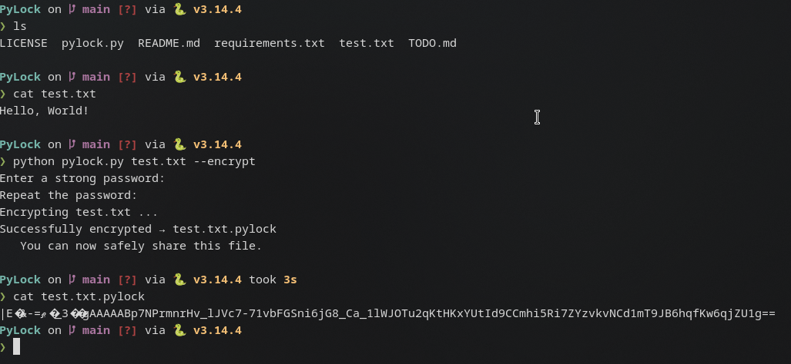

# PyLock
**PyLock** is a simple and secure command-line tool to encrypt and decrypt files using a password.
It uses strong cryptography (Fernet + PBKDF2) and adds a `.pylock` extension to encrypted files. Perfect for quickly securing sensitive files before sharing them via email, USB, cloud storage, etc.

---

## Features

- Simple and intuitive command-line interface
- Strong encryption using the `cryptography` library
- Password-based key derivation with high iteration count (PBKDF2 + SHA256)
- Automatic detection of already encrypted files
- Prevents accidental double encryption
- Works with **any file type** (documents, images, PDFs, videos, etc.)
- Cross-platform (Windows, macOS, Linux)

---

## Quick Demonstration



---

## Installation

1. Clone the repository or download the files
```bash
git clone https://github.com/Kiwilus/PyLock.git
```
2. Go into the PyLock directory
```bash
cd PyLock
```
3. Install the required dependency:
```bash
pip install -r requirements.txt
```

## Usage

| Action                        | Command                                                      | Short Version                                | Description |
|-------------------------------|--------------------------------------------------------------|----------------------------------------------|------|
| Encrypt a file                | `python pylock.py file.txt --encrypt`                        | `python pylock.py file.txt -e`               | Encrypts the file and saves it as `file.txt.pylock` |
| Decrypt a file                | `python pylock.py file.txt.pylock --decrypt`                 | `python pylock.py file.txt.pylock -d`        | Decrypts the `.pylock` file back to original |
| Ecrypt + delete Original file | `python pylock.py file.txt --encrypt --delete-original`      | `python pylock.py file.txt -e -D`            | Encrypt and delete source file|
| Encrypt with password         | `python pylock.py file.txt --encrypt --password password123` | `python pylock.py file.txt -e -p xyz`        | Provide password directly (not recommended) |
| Decrypt with password         | `python pylock.py file.txt.pylock --decrypt -p password123`  | `python pylock.py file.txt.pylock -d -p xyz` | Provide password directly (not recommended) |
| Show help                     | `python pylock.py --help`                                    | `python pylock.py -h`                        | Display help message |

> **⚠️ Warning**: Using the `--password` / `-p` option is **not recommended** because the password will be saved in your shell history.